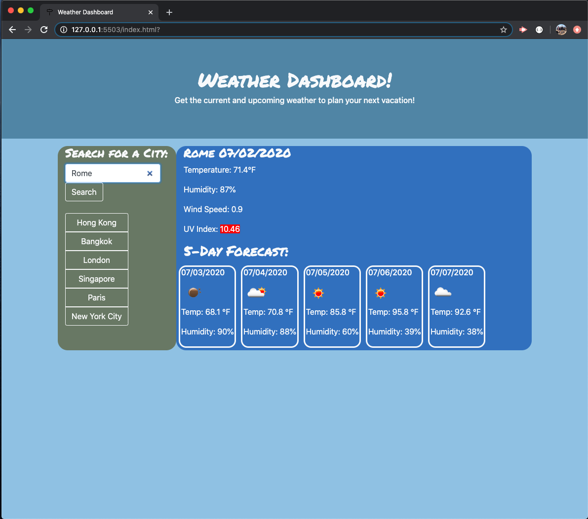

# weather-dashboard-hw6
-------------
## Introduction
-------------
Within this assignment, I am tasked with building a weather dashboard for
travelers to see upcoming weather on trips. I am mostly tasked here with using third-party API's to gather weather information and display it on the screen.

## Criteria
-------------

```
GIVEN a weather dashboard with form inputs
WHEN I search for a city
THEN I am presented with current and future conditions for that city and that city is added to the search history
WHEN I view current weather conditions for that city
THEN I am presented with the city name, the date, an icon representation of weather conditions, the temperature, the humidity, the wind speed, and the UV index
WHEN I view the UV index
THEN I am presented with a color that indicates whether the conditions are favorable, moderate, or severe
WHEN I view future weather conditions for that city
THEN I am presented with a 5-day forecast that displays the date, an icon representation of weather conditions, the temperature, and the humidity
WHEN I click on a city in the search history
THEN I am again presented with current and future conditions for that city
WHEN I open the weather dashboard
THEN I am presented with the last searched city forecast
```

## Summary
-------------
I feel like I am understanding concepts better! jQuery and AJAX are very useful tools in the way we can format our JavaScript. This was fun to get API calls to get current weather data. It makes the page so much more interactive so users only need to input a city at any moment to get what is going on there. Had a blast working through this assignment. Looking forward for more learning!

## Links and Screenshots
-------------

[Link to my deployed Weather Dashboard](https://j-midgley13.github.io/weather-dashboard-hw6/)


<br>



<br>

